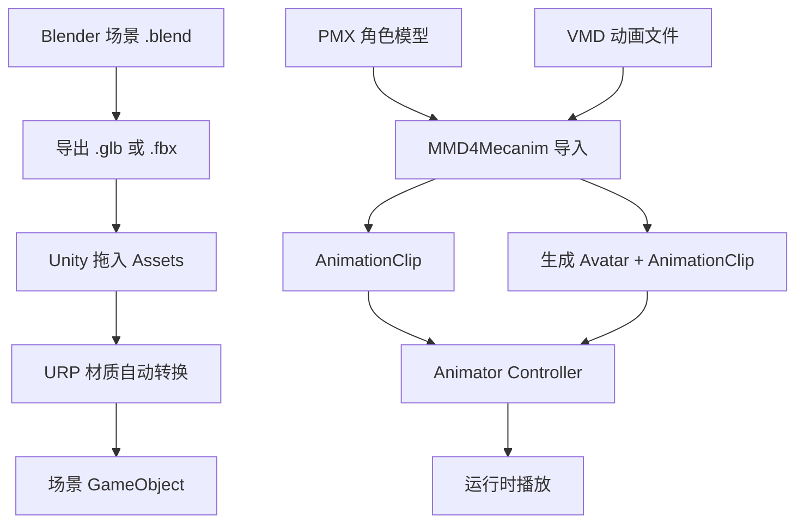

# 迁移到 Unity 引擎方案

## 一、为什么要迁移？

Three.js 当前遇到的限制：

| 问题 | 原因 | Unity 能否解决 |
|------|------|---------------|
| Blender 场景渲染失真 | 无间接光照/SSAO/反射 | ✅ 完美还原 |
| 光照系统需要手动搭建 | glTF 不支持 Blender 完整光照 | ✅ 原生支持 |
| 阴影怪异 / 材质偏色 | PBR 依赖环境贴图，配置复杂 | ✅ 自动兼容 |
| 很多物体「没渲染」 | glTF 不支持复杂材质节点 | ✅ 全部渲染 |
| 性能上限低 | 单线程 JS，大场景卡顿 | ✅ 多线程+GPU 加速 |

一句话：**如果场景复杂，Unity 是最省心的选择。**

---

## 二、迁移工作量评估

### ✅ 可以直接复用的资源

| 资源 | 路径 | 无需改动 |
|------|------|---------|
| PMX 模型（MMD 角色） | `./` | 需 Unity 插件导入 |
| VMD 动画文件 | `./` | 需 Unity 插件导入 |
| GLB 场景（ground.glb） | `./` | Unity 原生导入 |
| 对话 JSON 数据 | `./dialog_data.json` | 解析为 C# 对象即可 |

### ❌ 需要全部重写的功能

| 功能 | Three.js 实现 | Unity 实现方案 | 预估工时 |
|------|--------------|---------------|---------|
| 第一人称 WASD 操控 | `updateCamera()` + PointerLock | `CharacterController` + `MouseLook.cs` | 2h |
| MMD 动画播放 | MMDAnimationHelper | MMD4Mecanim 插件 | 4h |
| 对话框 / UI | HTML + CSS + JS | uGUI / TextMeshPro | 3h |
| 触摸操控 | 自定义 Joystick | 现有 Asset / 手写 | 2h |
| 碰撞检测 | AABB 手动计算 | Collider 组件 | 1h |
| 场景加载 | GLTFLoader | Addressables / 直接挂载 | 1h |
| 自动漫游 | 自定义路径 + TWEEN | `DOTween` / Timeline | 2h |
| 位置编辑 HUD | HTML 输入框 | uGUI InputField | 1h |
**总计预估：约 16h（熟练情况）**

---

## 三、技术方案对比

### 方案 A：Unity + MMD4Mecanim（推荐）

```
场景导入 ──→ 直接拖入 GLB/GLTF
MMD 模型  ──→ MMD4Mecanim 插件导入 .pmx
VMD 动画  ──→ MMD4Mecanim 转换为 Unity AnimationClip
第一人称  ──→ 标准 FPSController（Asset Store 或手写）
UI 系统   ──→ uGUI + TextMeshPro
```

**优点：** 生态成熟，MMD4Mecanim 是久经考验的付费插件
**缺点：** MMD4Mecanim 约 $50

### 方案 B：Unity + VMC-Standalone（免费）

```
VMD 文件 ──→ VMC-Standalone（外部工具）──→ 通过 OSC/VRM 传输到 Unity
Unity 端 ──→ VRM Model + OSC Receiver
```

**优点：** MMD 部分免费
**缺点：** 需要额外进程，延迟较高

### 方案 C：Unity + UniVRM + 手动转换 VMD

```
VMD 文件 ──→ 用 Blender 导出 VRM ──→ UniVRM 导入 Unity
VMD 动画 ──→ Blender 插件 Bake 到 VRM ──→ Unity 中播放
```

**优点：** 全开源免费
**缺点：** 工作流繁琐，VMD 到 VRM 转换需要工具链

---

## 四、推荐方案细节（方案 A）

### 4.1 Unity 版本与设置

- **Unity 版本：** Unity 2022.3 LTS 或 6000.0 LTS
- **渲染管线：** **URP（Universal Render Pipeline）**
  - 性能更好，移动端支持好
  - 与 Blender 视觉效果接近（AO / 反射 / 阴影均可开启）
  - 不需要 HDRP 的额外开销
- **后端：** DX11 / Vulkan

### 4.2 导入流程



### 4.3 场景布局

```
场景 (Scene)
├── 环境 (ground.glb)
│   ├── 网格 (MeshRenderer + Collider)
│   └── 灯光 (Directional Light × N)
├── 角色 (MMD Model)
│   ├── SkinnedMeshRenderer
│   ├── Animator (Controller)
│   └── MMD4Mecanim 组件
├── 第一人称相机
│   ├── Camera (主相机)
│   └── CharacterController (碰撞+移动)
├── UI (Canvas)
│   ├── 对话框系统
│   ├── 位置 HUD (支持编辑)
│   └── 状态栏 (FPS/帧)
├── 操控系统
│   ├── 鼠标输入 → 视角旋转
│   ├── 键盘输入 → WASD + 空格 + Shift
│   └── 触摸输入 → Joystick (移动端)
└── 系统
    ├── 路径漫游脚本
    ├── 对话管理器
    └── 设置管理器
```

### 4.4 关键脚本结构

```
Scripts/
├── PlayerController.cs        # 第一人称移动
├── MouseLook.cs               # 鼠标视角
├── MMDAnimationController.cs  # VMD 动画播放控制
├── DialogManager.cs           # 对话系统
├── UIManager.cs               # HUD + 坐标编辑
├── TouchInput.cs              # 触摸操控
├── PathWalker.cs              # 自动漫游
└── DataLoader.cs              # JSON 对话数据解析
```

### 4.5 需要购买的 Assets

| 名称 | 价格 | 用途 |
|------|------|------|
| MMD4Mecanim | ~$50 | PMX/VMD 导入 |
| DOTween (Pro) | 免费 | 动画补间 |

其余均为 Unity 内置功能。

---

## 五、实施步骤（分阶段）

### 第一阶段：基础搭建（约 4h）

1. 创建 Unity URP 项目
2. 导入 ground.glb 场景，挂 Collider
3. 实现第一人称 CharacterController + MouseLook
4. 实现 WASD + 空格/Shift 操控

### 第二阶段：MMD 集成（约 4h）

1. 购买/导入 MMD4Mecanim
2. 导入 PMX 模型，生成 Avatar
3. 导入 VMD 动画，绑定 Animator
4. 实现播放/暂停/循环控制

### 第三阶段：UI 与交互（约 5h）

1. 重构对话系统 (uGUI)
2. 位置 HUD + 编辑功能
3. 控制面板（设置）
4. 触摸操控

### 第四阶段：完善（约 4h）

1. 自动漫游路径系统
2. 性能优化（LOD / 阴影距离）
3. WebGL 导出发布
4. 测试与调优

---

## 六、WebGL 发布的注意事项

Unity WebGL 与当前 Three.js 的对比：

| 项目 | Three.js | Unity WebGL |
|------|---------|-------------|
| 加载方式 | 浏览器打开 | 生成 .html + wasm |
| 首次加载 | 快（轻量） | 较慢（需下载引擎） |
| 文件大小 | ~2MB | ~15-30MB |
| 性能 | 一般 | 好（wasm） |
| 兼容性 | 全部现代浏览器 | 需 WebGL 2.0 |

---

## 七、风险与建议

### 风险
1. **MMD4Mecanim 付费** — 约 $50，但可以7天试用
2. **VMD 动画精度** — 某些表情/IK 可能需要手动调整
3. **WebGL 包体大小** — 压缩后约 15-30MB，首次加载需要耐心

### 建议
1. **先 POC（概念验证）**：先花 2h 搭建一个空 Unity 项目，导入 ground.glb + MMD 模型，确认渲染效果
2. **保留 Three.js 版本**：新旧版本可以共存，互不影响
3. **如果场景不复杂，不值得迁移**：先让我调大 Three.js 的灯光强度再试一次？
